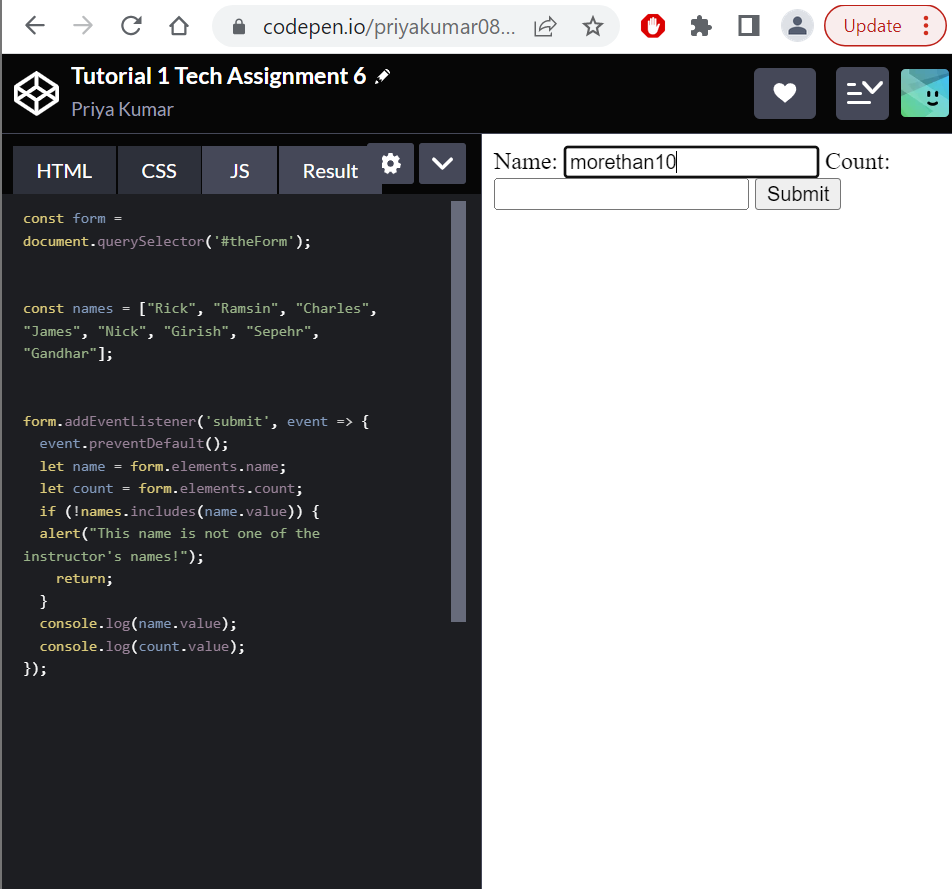

# Restaurant Ordering Project  
This project makes use of:  
- JavaScript
- Python
- HTML
- CSS

## Example Outputs:    
   
   

**Objective of assignment**:   
The objective of this last official tech assignment is to build a full end to end application from all the different concepts we learned in class (Backend, Frontend, server interactions, JavaScript, HTML, CSS, python, etc.) to create a restaurant ordering system. The tutorial goes over data validation that can be done at any level of the code, and its recommended to start validation as early as the HTML code. We watched a quick video on how to Join tables based on set theory. This helps us create any type of combinations of our given table to subsets of that table. This gives us control over how data is selected, so we can do a left or right join based on certain conditions like a book author id in a book table being compared to an author id in an authors table. We can do queries like focusing on one table and binding it to another based on primary and foreign keys. This assignment helps us prepare for the final challenge we later have to do, a full fledged website! 

## **Pre-project practice tutorial 1:** Data Validation
We learned data validation through HTML attributes and JavaScript. In CodePen, we have html code for a form and the corresponding JavaScript code to handle the form. After adding the **required attribute**, the form displays an alert indicating the input needs to be filled out. **The event listener is not run at this point and nothing is printed on the console**. We add a range of input values that we allow through **minlength and maxlength attributes**, 
and if only 1 character is inputted, we get an alert message that tells us to lengthen this text to 2 characters or more and that we are only using 1 character so far. For 10 characters or more, we actually don't even get to type out more than 10 characters by default due to this constraint we added. **The console has not printed anything when I include required**. We can use regular expressions for text input validation as well. For count, when we add a min of 0 and a max of 100, when I try to go past 100, it will not allow me. If I manually add a number over 100, I get an error alert saying the number must be between 0 and 100. For data validation **using JavaScript**, we can add an alert to specify if a name is valid or not. We use the example of inputting our own name, so Priya resulted in an alert displayed by the browser. We would use JavaScript for data validation also from requests made to the server, so checking the data returned (client side validation), and other inputs from forms that require input to be a certain condition. 
Link to CodePen: [CodePen](https://codepen.io/priyakumar0817/pen/yLxaWeQ)
Screenshot of empty input alert: 
Screenshot of range input 1 alert: 
Screenshot of range input 10 alert: 
Screenshot of range over 100 alert: ! [countrange](images/countrange.png)
Screenshot of javascript alert: 

## Restaurant Ordering System Info: 
We didn't get as much guidance for this challenege, only to make sure that this Restaurant Ordering system meets the requirements of dynamic updates of the menu, orders, order status, as well as validation of forms, persistent data, and CRUD operations in a RESTful way. I referenced online resources such as W3Schools, StackOverflow, and Professor Ramsin's code demo to help me with this challenge. I started my setting up my html pages, using forms and templating for the menu items as well as the order items, each in their own containers. I create CRUD functions in app.py that correspond to RESTful principles such as each CRUD operation having a correspoding function for both Menu_item and Orders tables in the database. In my CSS files, I style the containers based on the sample UI provided for each. I retrieved the elements needed in my client side JavaScript code and had a similar server request function for some of the CRUD functions like add and create, and simply invoked the get functions for retrieving data in seperate function calls. I needed to also ensure that on the admin page, when any order gets deleted, updated, or added, I have a fetch call to the Menu_items database to also apply those changes on top of the changes being dynamic on the webpage. Based on the refresh button, you can see that they were able to update on the other page, and dynamically update on the current admin.html page. This challenge helped me organize my code a little better, since I had templates which made it easier to add new menu and order items, and used **validation** in my html and javascript to ensure no erroneous data gets added to the database. The IA diagram is provided below as well as a video demo walkthrough of the entire challenge: 
I included my **information architecture** in this image: . 
